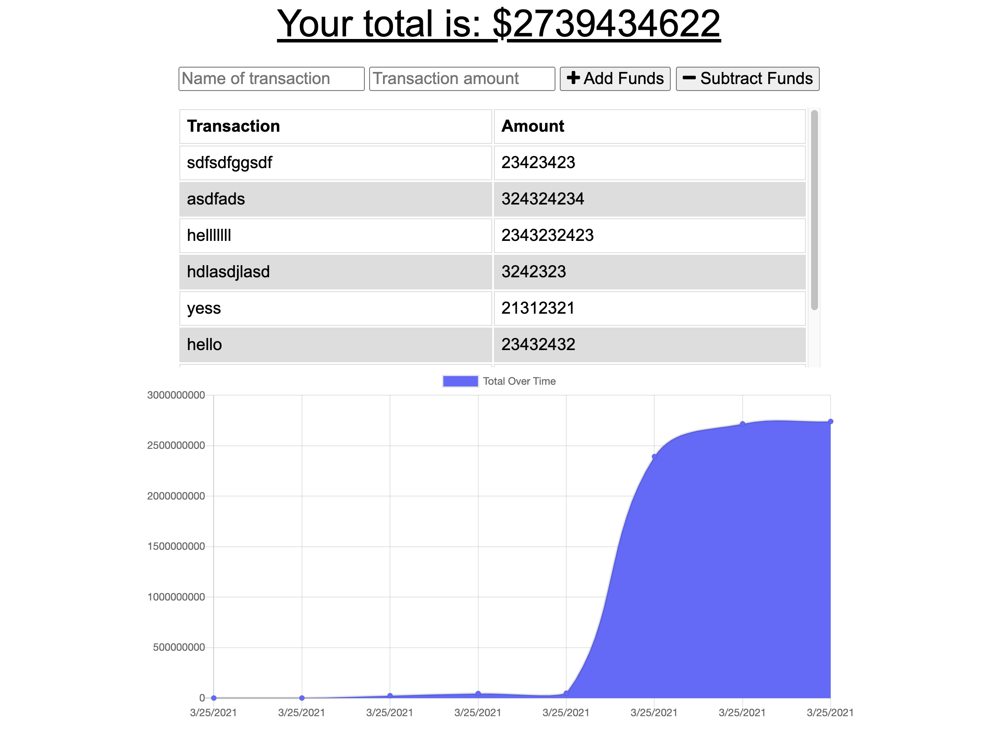
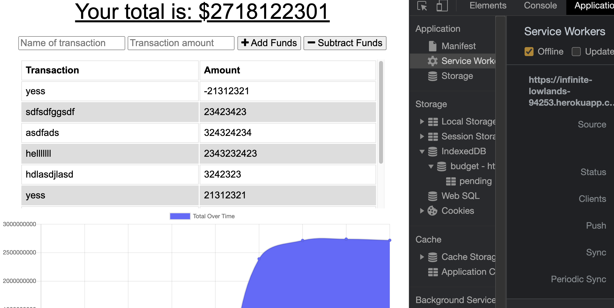

# Progressive-App

### Description
  The purpose of this application is to save the budgets we submited to mongodb database while we are working online, but if we happen to be working offline the submitted budgets will be stored in indexDb that is index database which is a front end database. As soon as we find a network then the stored data at the front-end that is in the indexDb will be stored automatically to mongodb database.


### Technologies Used

- Node.js
- mongo database
- mongoose
- express
- robo 3T
- morgan
- compression
- PWS
 - manifest.webmanifest
 - service-worker.js


## LINK TO THE REPOSITORY

[Progessive-App](https://github.com/elhiloyasin/progressive-app)

## Link of Deployed application

[Heroku](https://infinite-lowlands-94253.herokuapp.com/)

## Images of Application





## Contact Information

```
Feel free to contact me
```
 >
  Email | elhiloyasin@gmail.com|
  ------------------------------ 
  github | https://github.com/elhiloyasin
  ------------------------------ 


